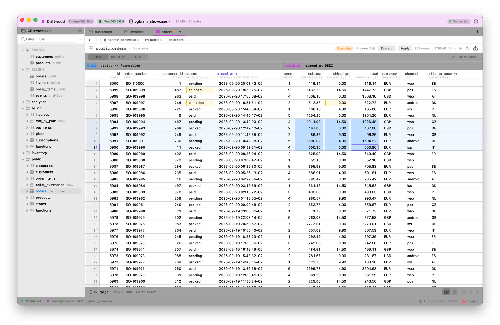
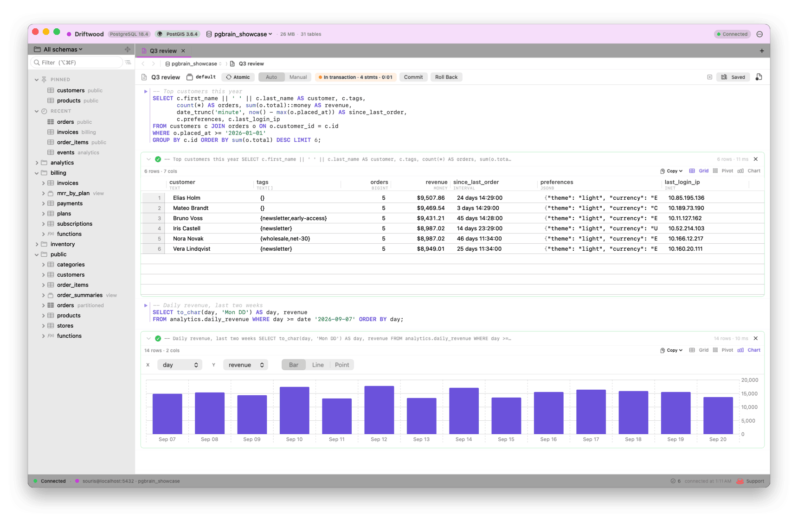
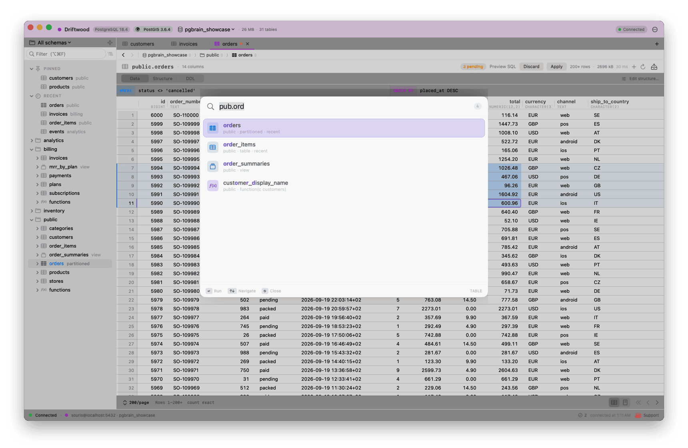
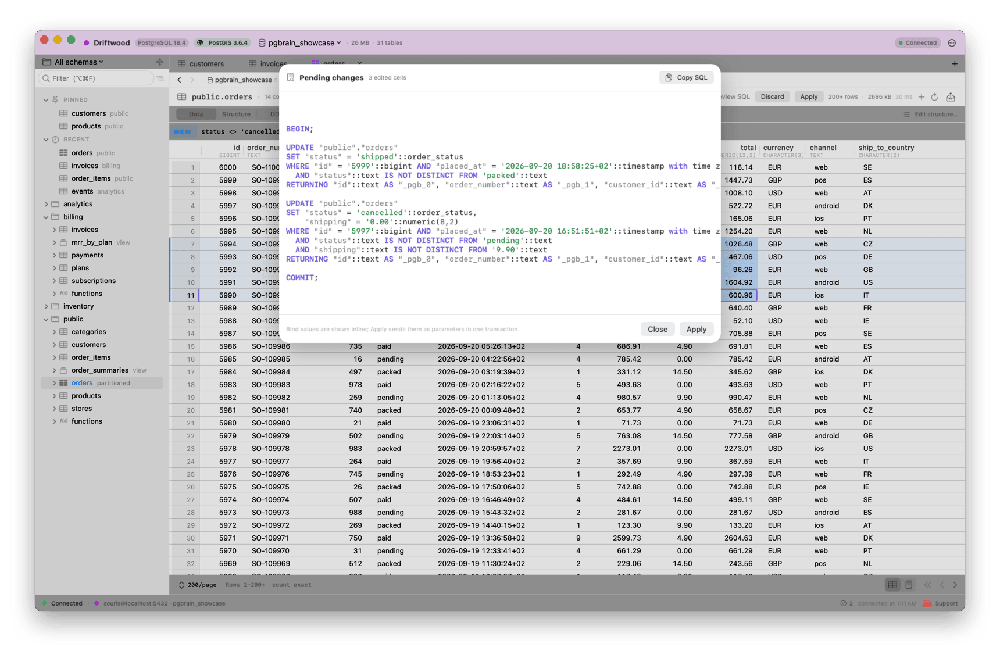
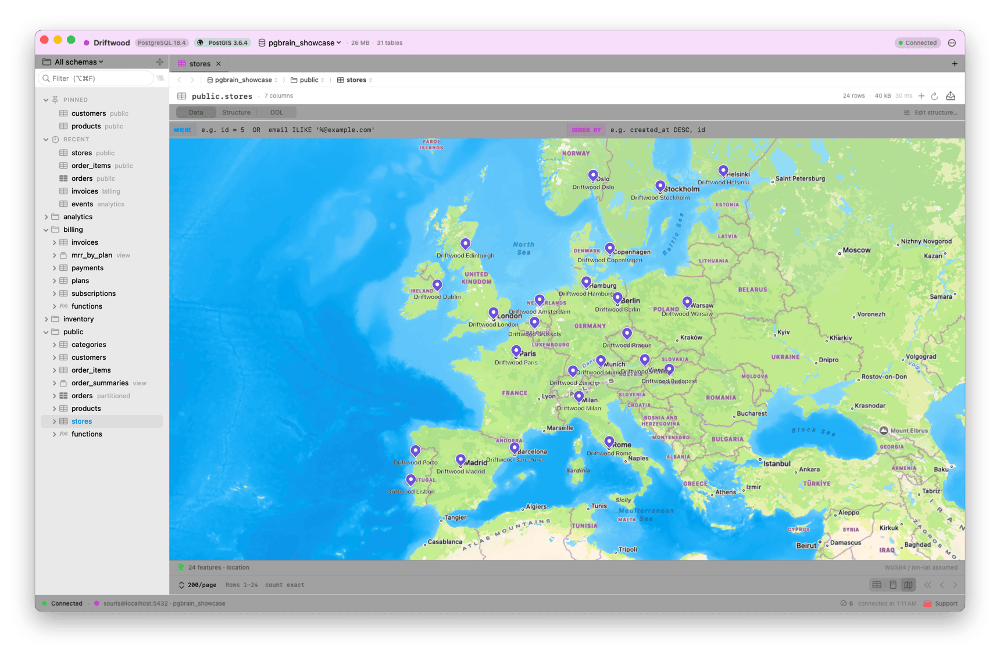

# pgBrain

**Pro PostgreSQL for macOS.** Native. Mac-fast. No Electron. No subscriptions. No telemetry.

    

> If JetBrains DataGrip and macOS had a kid that actually feels like a Mac app, you'd get pgBrain.

<p align="center">
  <picture>
    <source media="(prefers-color-scheme: dark)" srcset="docs/screenshots/01-hero-dark-framed.png">
    
  </picture>
</p>

## Why

JetBrains tools are powerful but feel like a Java app glued to your menu bar. The Postgres GUIs that *do* feel Mac-native are either toy projects or stuck circa 2017. pgBrain is the missing middle — DataGrip-density workflows in a SwiftUI/AppKit shell that respects your trackpad, your dark mode, and your battery.

## A closer look

<table>
  <tr>
    <td width="50%">
      <picture>
        <source media="(prefers-color-scheme: dark)" srcset="docs/screenshots/02-scratchpad-dark-framed.png">
        
      </picture>
      <p align="center"><sub>Notebook scratchpad — one server session, a live transaction, psql-exact types, inline chart</sub></p>
    </td>
    <td width="50%">
      <picture>
        <source media="(prefers-color-scheme: dark)" srcset="docs/screenshots/03-go-to-table-dark-framed.png">
        
      </picture>
      <p align="center"><sub>Go to Table (⌘O) — fuzzy <code>pub.ord</code>, recents first</sub></p>
    </td>
  </tr>
  <tr>
    <td width="50%">
      <picture>
        <source media="(prefers-color-scheme: dark)" srcset="docs/screenshots/04-preview-sql-dark-framed.png">
        
      </picture>
      <p align="center"><sub>Staged edits → Preview SQL → Apply in one transaction</sub></p>
    </td>
    <td width="50%">
      <picture>
        <source media="(prefers-color-scheme: dark)" srcset="docs/screenshots/06-map-dark-framed.png">
        
      </picture>
      <p align="center"><sub>PostGIS columns on a real map</sub></p>
    </td>
  </tr>
</table>

More in [docs/screenshots](docs/screenshots/) (ERD, EXPLAIN plans, structure, connection editor, activity), in light and dark.

## What's in the box

### Windows, tabs & navigation
- 🪟 **One window per database.** Switch databases from the title bar; each opens in its own window. Multi-tab workspaces with preview tabs (single-click), pinned tabs, Close Others / to the Right, overflow menu, drag-reorder, rename + colour tags.
- 🗂️ **Schema sidebar that stays put.** Remembers what you expanded, focuses on the schemas you pick, hides extension clutter, nests partitions, and has Pinned + Recent tables on top. Fuzzy filter (`pub.us` → `public.users`) that holds up on 10k+ tables.
- 🧭 **Go anywhere fast.** ⌘O Go to Table (recents first), ⌘K for everything, ⌘[ / ⌘] back and forward (including FK jumps), and a `database ▸ schema ▸ table` breadcrumb with sibling menus.
- 🧭 **Guided first-run tour.** A one-minute spotlight tour of the window and its shortcuts the first time you connect; Help ▸ Show Tour replays it.
- ⌨️ **IDE keyboard model.** ⌘T new scratchpad in the selected schema, ⌘1–9 tab jump, ⌃1–9 window jump, ⌘B sidebar, ⌘R reload, ⌘F find, Return/Space in the tree — the muscle memory you already have.
- 💾 **Saved workspaces + state restoration.** Snapshot a tab set, or just quit and relaunch to find every window and tab where you left it.

### Reading & editing data
- 📋 **Spreadsheet-grade grid.** Cell and range selection, ⌘C / ⌘V as TSV, Tab/Return navigation, type to edit, ⌫ for NULL, ⌘Z / ⌘⇧Z. Every change is staged: preview the exact SQL, Apply (⌘S) in one transaction, and pgBrain refuses to overwrite a row someone else changed. Tables without a primary key are editable too.
- 📇 **Row form view.** Flip any grid to a single-row vertical form with ←/→ stepping — edits share the grid's dirty set.
- 🔎 **Filter, sort, paginate.** WHERE/ORDER BY strip with autocomplete, sortable headers, keyset-friendly paging, filter-to-cell, distinct-values popover per column, FK ⌘-click navigation.
- 📊 **Pivot & chart.** Pivot any result (row/col/value + agg) or chart it (bar/line/point) without leaving the result block.
- 🪄 **Generate test data.** Per-column strategies → one `INSERT … SELECT generate_series` with a live SQL preview.
- 🧮 **Column profiler.** Right-click any column → rows / nulls (with a populated bar) / distinct / min·max·avg, scoped to your active filter.
- 🗑️ **Delete rows — staged, not instant.** Right-click one or a multi-selection → rows get a red wash and commit on **Apply**, in the *same transaction* as your edits and inserts (or Discard to undo). Paging, sorting or closing the tab asks before dropping anything.
- 📑 **Copy as…** Markdown, JSON, TSV (paste into spreadsheets), or CSV — from any result block or the table grid.

### The notebook scratchpad
- 📝 **Inline results.** SQL and result widgets in one flowing document. Cmd+⏎ runs the statement under your caret; the result inlines right after it. Every type renders exactly as psql prints it.
- 🔗 **A real session per scratchpad.** `SET`, temp tables and `BEGIN` persist between runs; a transaction indicator with Commit / Roll Back and an Auto / Manual commit switch.
- 🐘 **psql slash commands.** `\dt`, `\d table`, `\df`, `\du`, `\l`, `\dn`, `\dx` … translated to catalog queries inline.
- 🔁 **Run-as-transaction.** Wrap a multi-statement run in BEGIN/COMMIT — any error rolls the whole batch back.
- ✨ **Editor niceties.** Syntax highlighting, schema-aware autocomplete + hover, bracket/quote auto-pairing, auto-indent, Format SQL, `EXPLAIN`/`EXPLAIN ANALYZE` plan viewer, find/replace, snippets with `$cursor$` placeholders, open/save `.sql`.
- 📜 **Query history + result diff.** Every statement logged with timing; diff the last two results side-by-side.

### DBA & schema management
- 🏗️ **Structure pane.** Columns, constraints, indexes, triggers (enable/disable/drop), partitions, comments editor — plus a Copy-ready `CREATE` script.
- 🎛️ **Table Designer.** One visual editor for **creating and restructuring** tables — add/rename/retype/drop columns, NOT NULL, primary key, defaults, comments — with a live `ALTER TABLE` diff that applies **atomically in one transaction**. ("Edit structure…" on a table, or ⌘K.)
- 🧩 **Function Designer + runner.** One editor to **create and restructure**
  functions/procedures — schema · name · args · returns · language · volatility ·
  strict · security, over a body editor with a live `CREATE OR REPLACE` preview;
  signature changes DROP + recreate in one transaction, and functions with
  attributes the form can't model fall back to full-DDL editing so nothing is
  lost. Right-click → **Run** (or **Call**) any routine to fill its parameters
  and execute it inline.
- ✏️ **Edit objects.** View/matview editor, column ALTER (rename/type/drop/add),
  schema + database CRUD, sequence inspector (setval/nextval/restart).
- 🧹 **Maintenance.** VACUUM / ANALYZE / REINDEX / TRUNCATE / REFRESH MATERIALIZED VIEW from the sidebar, tracked in the ops popover.
- 🗺️ **ERD diagram.** Draggable table boxes, FK lines, double-click to open.
- 🔗 **Find usages.** Locate a table across every function body, view definition, and trigger.
- 🔐 **Roles & grants.** Browse `pg_roles`, view per-table grants, GRANT/REVOKE editor.
- 📈 **Live activity panels.** Sessions, locks, index usage, `pg_stat_statements`, size dashboard, replication (pubs/subs/slots), foreign tables/FDW.
- 📡 **LISTEN/NOTIFY console.** Subscribe to a channel, watch payloads stream in, send NOTIFYs back.

### Safety, transport & ops
- 🛑 **Production guardrails.** Mark a connection PROD → red chrome everywhere; unscoped `DELETE`/`UPDATE`/`TRUNCATE`/DDL prompts before it runs.
- 🧷 **Read-only connections & timeouts.** Per-connection read-only mode, statement and idle-in-transaction timeouts, applied to every session.
- 🔒 **SSH tunnels & TLS.** Local-forward via the system `ssh` (agent or key file), supervised and restarted if it drops; custom root CA and client certificates; verify-full works through tunnels.
- 🔄 **Survives sleep.** Connections notice a dead link after sleep or a network change and reconnect on their own.
- 📥 **Bring your connections.** Paste a `postgres://` URL, import `~/.pg_service.conf`, fill passwords from `~/.pgpass`.
- ⏯️ **Real cancellation.** Stop sends the protocol's own cancel request for exactly your statement — the same thing `psql` does on `^C`.
- ↔️ **Cross-DB copy.** Stream a table between connections via `SELECT` → `COPY FROM STDIN`. Flat memory regardless of row count.
- 📤📥 **Streaming export/import.** CSV/JSON/SQL export at any size; CSV/JSON import with header→column mapping, encoding and delimiter options; `pg_dump` / `pg_restore` that pick the right PostgreSQL version (up to 18) automatically.
- 🔔 **Long-query notifications.** Background queries over 30s ping you when they finish.
- ⚙️ **Sparkle auto-update.** Signed + notarized; pgBrain checks for new versions daily and on launch, and asks before installing.

## Download

[**→ Latest release (DMG)**](https://github.com/souriscloud/pgbrain/releases/latest)

1. Open the DMG, drag **pgBrain** onto **Applications**.
2. Launch pgBrain.
3. Add your first connection on the Welcome window.

> Signed with our Developer ID and notarized by Apple. Auto-updates via Sparkle so you only download once.

## Requires

- macOS 15 Sequoia or newer
- Apple Silicon Mac (arm64)

## Support the work

pgBrain is built by [Lukáš Novotný](https://bio.souris.cloud) at [Souris.CLOUD](https://apps.souris.cloud) — one human, no VC. If pgBrain saves you an hour, [buy me a coffee](https://ko-fi.com/souriscloud). ☕

## Build from source

```bash
git clone https://github.com/souriscloud/pgbrain.git
cd pgbrain
./scripts/run.sh                # debug build + bundle + launch
./scripts/bundle.sh release     # release build → build/pgBrain.app
swift test                      # needs a local Postgres db "pgbrain_demo", or PGBRAIN_TEST_DSN
```

Pure SwiftPM. No Xcode project — though you can open the package in Xcode if you want a graphical debugger. See [CLAUDE.md](CLAUDE.md) for architecture and conventions, [PLAN.md](PLAN.md) for what's in flight, and [CHANGELOG.md](CHANGELOG.md) for release history.

## Releasing

See [RELEASE.md](RELEASE.md). One command (`./scripts/release.sh patch`) does bump → bundle → codesign → notarize → DMG → sign update → push → publish.

## License

AGPL-3.0. If you fork it, fork it loud.

## Links

- 🌐 [apps.souris.cloud/apps/pgbrain](https://apps.souris.cloud/apps/pgbrain)
- 🧑‍💻 [github.com/souriscloud/pgbrain](https://github.com/souriscloud/pgbrain)
- ☕ [ko-fi.com/souriscloud](https://ko-fi.com/souriscloud)
- 🐦 [bio.souris.cloud](https://bio.souris.cloud)
